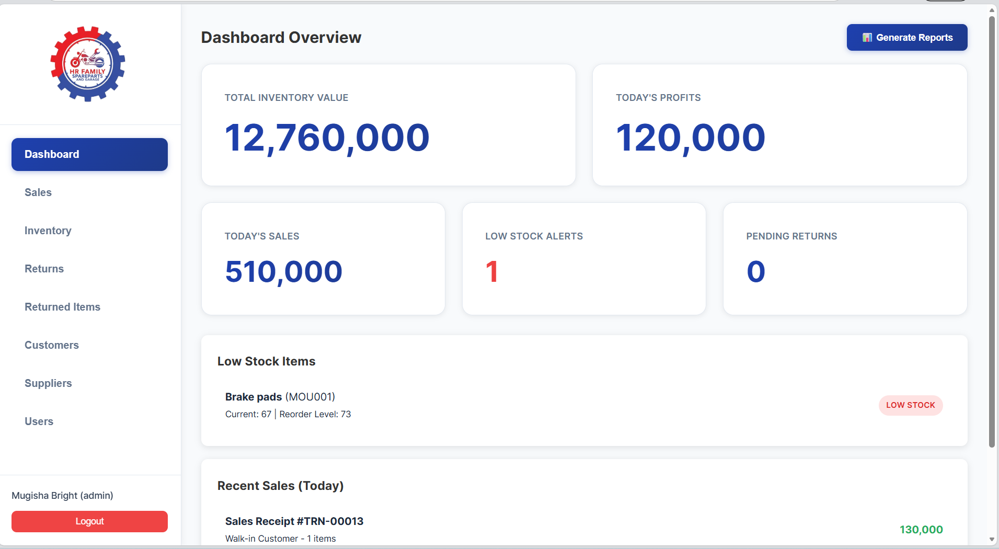
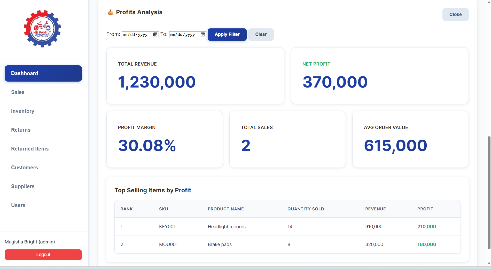
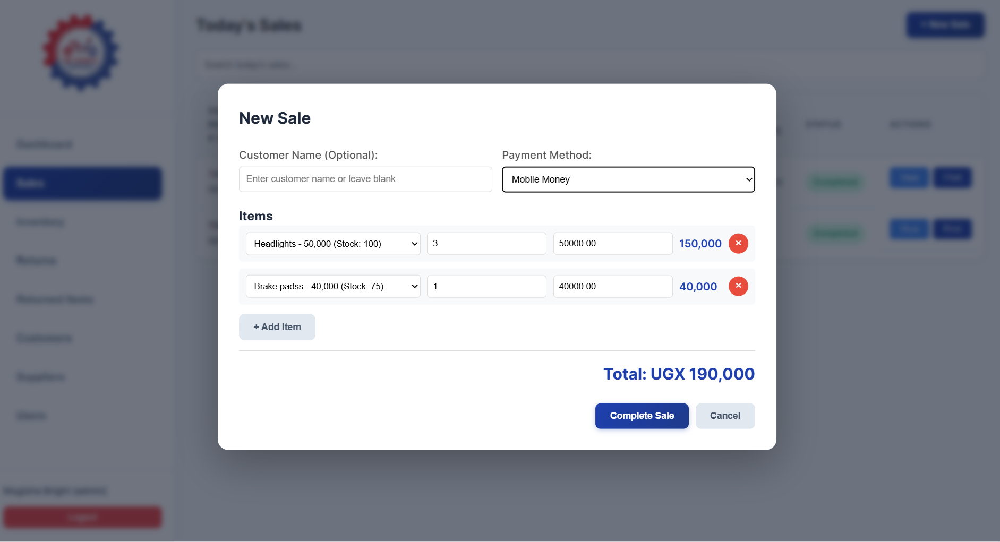
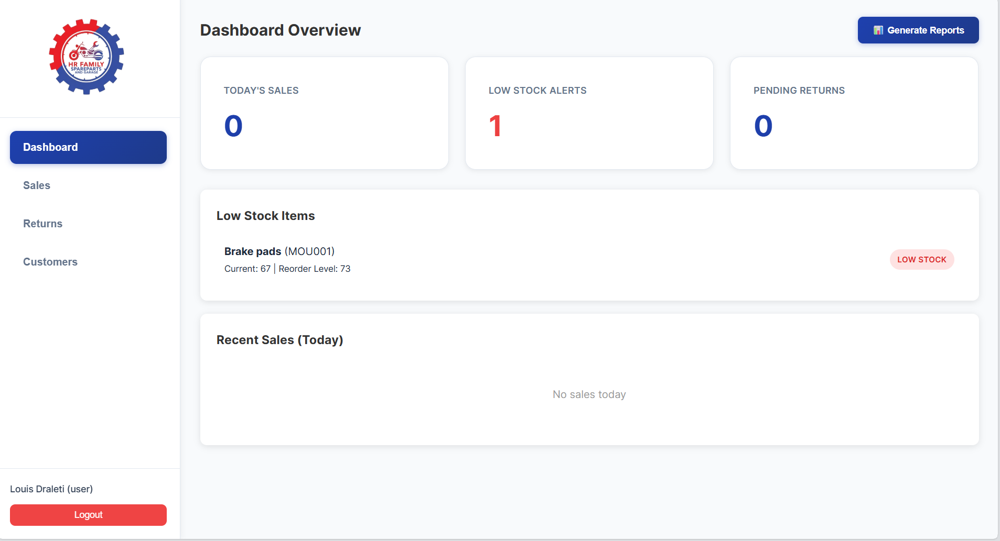

# Inventory Management System - Demo

> **DEMO VERSION** - This is a demonstration repository with sanitized data. Try the live demo at: [https://hrfamily-inventory-system-production.up.railway.app/)

A comprehensive inventory management system for spare parts companies, built with Node.js, Express, and PostgreSQL.

## Application Screenshots

<div align="center">

### Modern, Intuitive Login Interface

*Clean and professional authentication with secure session management*

---

### Comprehensive Admin Dashboard

*Real-time business metrics and inventory overview at a glance*

---

### Advanced Profit Analysis

*Detailed financial insights with top-selling items and profit margins*

---

### Streamlined Sales Management

*Efficient transaction processing with comprehensive sales history*

---

### User-Friendly Interface

*Role-based dashboards optimized for different user levels*

</div>

## Demo Credentials

**For Demo/Testing Purposes:**

- **Admin Account:**
  - Username: `admin`
  - Password: `admin123`

- **User Account:**
  - Username: `user`
  - Password: `user123`

> ⚠️ **IMPORTANT FOR PRODUCTION:** Change these credentials immediately after deployment! Use strong passwords and update all environment variables with secure values.

## Features

- **Inventory Management**: Track spare parts, stock levels, and reorder points
- **Sales Processing**: Create sales transactions and generate receipts
- **Returns Management**: Handle product returns with approval workflow
- **Customer Management**: Track customer information and purchase history
- **Supplier Management**: Manage supplier contacts and product catalogs
- **User Management**: Role-based access control (Admin/User)
- **Reporting**: Generate sales, inventory, and customer reports
- **Security**: Password hashing, rate limiting, input validation, CORS protection

## Tech Stack

- **Backend**: Node.js, Express.js
- **Database**: PostgreSQL with node-postgres (pg)
- **Security**: bcrypt, helmet, express-rate-limit, express-validator
- **Session Store**: connect-pg-simple (PostgreSQL session store)
- **Frontend**: Vanilla JavaScript, HTML5, CSS3

## Prerequisites

- Node.js >= 20.x
- npm >= 9.0.0
- PostgreSQL >= 12.0

## Installation

1. Clone the repository:
```bash
git clone https://github.com/draletilouis/inventory-system-demo.git
cd inventory-system-demo
```

2. Install dependencies:
```bash
npm install
```

3. Set up PostgreSQL database:
```bash
# Create a new PostgreSQL database
createdb inventory

# Or using psql
psql -U postgres
CREATE DATABASE inventory;
```

4. Configure environment variables:
```bash
cp .env.example .env
```

5. Edit `.env` and update the following:
   - `POSTGRES_HOST`: PostgreSQL host (default: localhost)
   - `POSTGRES_PORT`: PostgreSQL port (default: 5432)
   - `POSTGRES_DB`: Database name (default: inventory)
   - `POSTGRES_USER`: PostgreSQL username (default: postgres)
   - `POSTGRES_PASSWORD`: PostgreSQL password
   - `SESSION_SECRET`: Generate a strong random secret (use: `npm run generate-secret`)
   - For Railway deployment, use `DATABASE_URL` instead of individual variables

6. Initialize the database:
```bash
npm run init-postgres
```

## Running the Application

### Development Mode
```bash
npm run dev
```
The server will start on `http://localhost:3000` with auto-reload enabled.

### Production Mode
```bash
npm start
```

## Demo Credentials

**For Demo/Testing Purposes Only:**

- Admin Account:
  - Username: `admin`
  - Password: `admin123`

- User Account:
  - Username: `user`
  - Password: `user123`

**⚠️ IMPORTANT FOR PRODUCTION:** Change these credentials immediately after deployment! Use strong passwords and update all environment variables with secure values.

## Deployment

### Option 1: Heroku

1. Install the Heroku CLI
2. Login to Heroku:
```bash
heroku login
```

3. Create a new Heroku app:
```bash
heroku create your-app-name
```

4. Set environment variables:
```bash
heroku config:set NODE_ENV=production
heroku config:set SESSION_SECRET=$(node -e "console.log(require('crypto').randomBytes(32).toString('hex'))")
heroku config:set ALLOWED_ORIGINS=https://your-app-name.herokuapp.com
```

5. Deploy:
```bash
git push heroku master
```

6. Open your app:
```bash
heroku open
```

### Option 2: Railway

1. Install Railway CLI or use the web interface
2. Create a new project
3. Connect your GitHub repository
4. Set environment variables in Railway dashboard:
   - `NODE_ENV=production`
   - `SESSION_SECRET` (generate a random key)
   - `ALLOWED_ORIGINS` (your Railway domain)
5. Deploy automatically on push

### Option 3: DigitalOcean / VPS

1. SSH into your server:
```bash
ssh user@your-server-ip
```

2. Install Node.js and npm:
```bash
curl -fsSL https://deb.nodesource.com/setup_18.x | sudo -E bash -
sudo apt-get install -y nodejs
```

3. Clone and setup:
```bash
git clone https://github.com/draletilouis/inventory-system-demo.git
cd inventory-system-demo
npm install
```

4. Configure environment:
```bash
cp .env.example .env
nano .env  # Edit configuration
```

5. Install PM2 for process management:
```bash
sudo npm install -g pm2
```

6. Start the application:
```bash
pm2 start ecosystem.config.js --env production
pm2 save
pm2 startup
```

7. Setup Nginx as reverse proxy:
```bash
sudo apt install nginx
sudo nano /etc/nginx/sites-available/inventory
```

Add this configuration:
```nginx
server {
    listen 80;
    server_name your-domain.com;

    location / {
        proxy_pass http://localhost:3000;
        proxy_http_version 1.1;
        proxy_set_header Upgrade $http_upgrade;
        proxy_set_header Connection 'upgrade';
        proxy_set_header Host $host;
        proxy_cache_bypass $http_upgrade;
    }
}
```

Enable the site:
```bash
sudo ln -s /etc/nginx/sites-available/inventory /etc/nginx/sites-enabled/
sudo nginx -t
sudo systemctl restart nginx
```

8. Setup SSL with Let's Encrypt:
```bash
sudo apt install certbot python3-certbot-nginx
sudo certbot --nginx -d your-domain.com
```

### Option 4: Docker (Optional)

Create a `Dockerfile`:
```dockerfile
FROM node:18-alpine
WORKDIR /app
COPY package*.json ./
RUN npm ci --only=production
COPY . .
EXPOSE 3000
CMD ["npm", "start"]
```

Build and run:
```bash
docker build -t inventory-system .
docker run -p 3000:3000 --env-file .env inventory-system
```

## Environment Variables

| Variable | Description | Default |
|----------|-------------|---------|
| `NODE_ENV` | Environment (development/production) | development |
| `PORT` | Server port | 3000 |
| `POSTGRES_HOST` | PostgreSQL host | localhost |
| `POSTGRES_PORT` | PostgreSQL port | 5432 |
| `POSTGRES_DB` | PostgreSQL database name | inventory |
| `POSTGRES_USER` | PostgreSQL username | postgres |
| `POSTGRES_PASSWORD` | PostgreSQL password | (required) |
| `POSTGRES_SSL` | Enable SSL for PostgreSQL | false |
| `DATABASE_URL` | PostgreSQL connection string (Railway) | (optional) |
| `SESSION_SECRET` | Secret key for sessions | (required) |
| `BCRYPT_ROUNDS` | Bcrypt hashing rounds | 10 |
| `RATE_LIMIT_WINDOW_MS` | Rate limit window (ms) | 900000 |
| `RATE_LIMIT_MAX_REQUESTS` | Max requests per window | 10000 |

## Security Best Practices

1. **Change Default Credentials**: Immediately change the default admin and user passwords
2. **Use Strong Secrets**: Generate cryptographically secure random keys for `SESSION_SECRET`
3. **Enable HTTPS**: Always use HTTPS in production (use Let's Encrypt for free SSL)
4. **Update CORS**: Set `ALLOWED_ORIGINS` to your actual domain(s)
5. **Regular Updates**: Keep dependencies updated (`npm audit` and `npm update`)
6. **Database Backups**: Regularly backup your PostgreSQL database using `pg_dump`
7. **Monitor Logs**: Check logs for suspicious activity
8. **Rate Limiting**: Adjust rate limits based on your traffic patterns

## Database Backup

For PostgreSQL database backups:

```bash
# Manual backup
pg_dump -U postgres inventory > backup.sql

# Backup with custom format (compressed)
pg_dump -U postgres -Fc inventory > backup.dump

# Restore from backup
psql -U postgres inventory < backup.sql
# Or for custom format:
pg_restore -U postgres -d inventory backup.dump

# Automated backup (add to cron)
0 0 * * * pg_dump -U postgres inventory > /path/to/backups/inventory-$(date +\%Y\%m\%d).sql
```

## API Endpoints

### Authentication
- `POST /api/login` - User login

### Inventory
- `GET /api/inventory` - Get all inventory items
- `GET /api/inventory/:id` - Get specific item
- `POST /api/inventory` - Add new item
- `PUT /api/inventory/:id` - Update item
- `DELETE /api/inventory/:id` - Delete item

### Sales
- `GET /api/sales` - Get sales records
- `GET /api/sales/:id` - Get specific sale
- `POST /api/sales` - Create new sale

### Returns
- `GET /api/returns` - Get returns
- `POST /api/returns` - Create return request
- `PUT /api/returns/:id` - Update return status

### Customers
- `GET /api/customers` - Get all customers
- `POST /api/customers` - Add customer
- `PUT /api/customers/:id` - Update customer
- `DELETE /api/customers/:id` - Delete customer

### Suppliers
- `GET /api/suppliers` - Get all suppliers
- `POST /api/suppliers` - Add supplier
- `PUT /api/suppliers/:id` - Update supplier
- `DELETE /api/suppliers/:id` - Delete supplier

### Users
- `GET /api/users` - Get all users (Admin only)
- `POST /api/users` - Create user (Admin only)
- `PUT /api/users/:id` - Update user
- `DELETE /api/users/:id` - Delete user (Admin only)

## Troubleshooting

### Database Connection Error
If you get database connection errors:
1. Verify PostgreSQL is running: `sudo systemctl status postgresql` (Linux) or check services on Windows
2. Check DATABASE_URL is correctly set in `.env`
3. Verify PostgreSQL credentials and database exists
4. Check PostgreSQL logs for detailed error messages

### CORS Errors
Update `ALLOWED_ORIGINS` in `.env` to include your frontend domain.

### Port Already in Use
Change the `PORT` in `.env` or stop the process using port 3000:
```bash
# Find process
lsof -i :3000
# Kill process
kill -9 <PID>
```

## Performance Optimization

1. **Connection Pooling**: PostgreSQL connection pooling is configured in the code
2. **Use PM2 clustering**: Uncomment `instances: 'max'` in `ecosystem.config.js`
3. **Add Redis for sessions**: For multi-instance deployments (alternative to connect-pg-simple)
4. **Database indexing**: Already optimized with primary keys and indexes
5. **Gzip compression**: Add compression middleware if needed
6. **PostgreSQL tuning**: Adjust PostgreSQL settings (shared_buffers, work_mem) based on your server resources

## Contributing

1. Fork the repository
2. Create a feature branch (`git checkout -b feature/AmazingFeature`)
3. Commit your changes (`git commit -m 'Add some AmazingFeature'`)
4. Push to the branch (`git push origin feature/AmazingFeature`)
5. Open a Pull Request

## License

This project is licensed under the MIT License.

## Live Demo

Visit the live demo: https://hrfamily-inventory-system-production.up.railway.app/)

Login with:
- Admin: `admin` / `admin123`
- User: `user` / `user123`

## Support

For issues and questions:
- GitHub Issues: https://github.com/draletilouis/inventory-system-demo/issues

## Changelog

### Version 1.0.0 (Current)
- Initial release
- Complete inventory management system
- User authentication and authorization
- Sales and returns processing
- Customer and supplier management
- Reporting capabilities
- Production-ready security features

---

